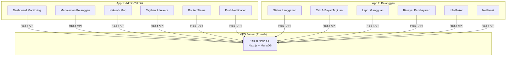
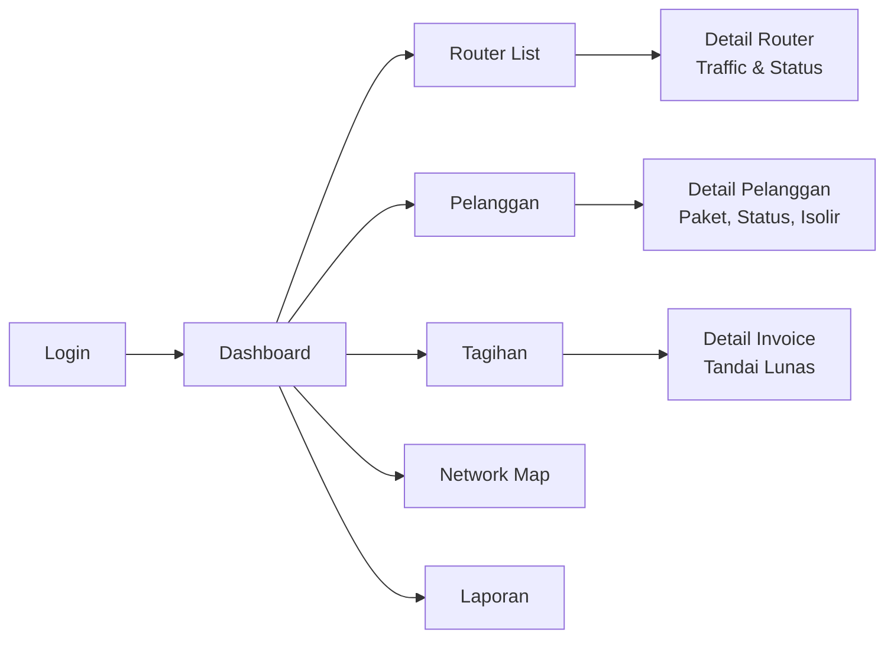
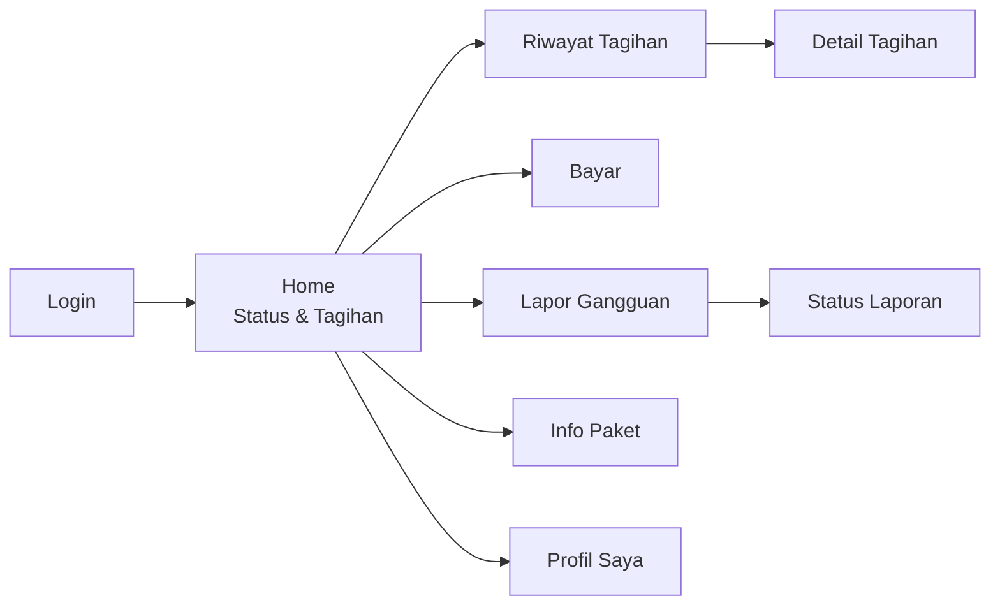

# 📱 JARFI Mobile — Planning Android APK (Flutter)

## Ringkasan Proyek

Membuat **2 aplikasi Android terpisah** berbasis Flutter yang terhubung ke backend JARFI NOC via REST API.



---

## 📋 Yang Dibutuhkan (Persiapan)

### 1. Development Tools

| Tool | Kegunaan | Install |
|------|----------|---------|
| **Flutter SDK** | Framework mobile | [flutter.dev/get-started](https://flutter.dev/docs/get-started/install) |
| **Android Studio** | IDE + Android SDK + Emulator | [developer.android.com](https://developer.android.com/studio) |
| **Java JDK 17** | Build Android | Biasanya sudah include di Android Studio |
| **VS Code** (opsional) | Editor alternatif + Flutter extension | Sudah ada |
| **Git** | Version control | Sudah ada |

### 2. Akun & Sertifikat

| Item | Kegunaan | Biaya |
|------|----------|-------|
| **Google Play Developer** | Publish ke Play Store | $25 sekali bayar |
| **Keystore (.jks)** | Sign APK untuk release | Gratis (generate sendiri) |
| **Firebase Account** | Push notification (FCM) | Gratis |

### 3. VPS / Server

| Item | Spesifikasi | Estimasi |
|------|-------------|----------|
| **VPS** (opsional jika di rumah) | 2 vCPU, 4GB RAM, Ubuntu 22.04 | Rp 100-300rb/bulan |
| **Domain** | jarfi.net (sudah punya?) | Rp 100-150rb/tahun |
| **SSL Certificate** | HTTPS wajib untuk API | Gratis (Let's Encrypt) |
| **Static IP / DDNS** | Agar server di rumah bisa diakses | Tergantung ISP |

> [!IMPORTANT]
> Jika server di rumah, butuh:
> - IP Publik statis ATAU layanan DDNS (no-ip.com, duckdns.org)
> - Port forwarding di router (port 443 → server lokal)
> - SSL certificate (wajib untuk API mobile)

---

## 📱 App 1: JARFI Admin (Teknisi & Admin)

### Fitur Lengkap

| # | Fitur | Prioritas | Deskripsi |
|---|-------|-----------|-----------|
| 1 | **Dashboard** | 🔴 P0 | Statistik real-time: total pelanggan, revenue, router online/offline |
| 2 | **Router Monitor** | 🔴 P0 | Status semua router MikroTik, traffic live, uptime |
| 3 | **Pelanggan** | 🔴 P0 | List, search, detail, edit status (active/isolir) |
| 4 | **Tagihan** | 🔴 P0 | Generate, kirim, tandai lunas |
| 5 | **Push Notification** | 🟡 P1 | Alert saat router down, pelanggan baru, pembayaran masuk |
| 6 | **Network Map** | 🟡 P1 | Peta lokasi router & pelanggan (Google Maps/OSM) |
| 7 | **Isolir Otomatis** | 🟡 P1 | Trigger isolir manual dari HP |
| 8 | **Laporan** | 🟢 P2 | Revenue harian/bulanan, chart |
| 9 | **AI Assistant** | 🟢 P2 | Chat dengan Gemini AI untuk troubleshoot |
| 10 | **Multi-User** | 🟢 P2 | Login per teknisi, assignment tugas |

### Screen Flow



---

## 📱 App 2: JARFI Pelanggan

### Fitur Lengkap

| # | Fitur | Prioritas | Deskripsi |
|---|-------|-----------|-----------|
| 1 | **Login** | 🔴 P0 | Login dengan email/no.HP yang terdaftar |
| 2 | **Status Langganan** | 🔴 P0 | Paket aktif, masa aktif, status (active/isolir) |
| 3 | **Tagihan** | 🔴 P0 | Lihat tagihan bulan ini, riwayat |
| 4 | **Bayar Tagihan** | 🟡 P1 | Integrasi payment gateway (Midtrans/Xendit) |
| 5 | **Lapor Gangguan** | 🟡 P1 | Form laporan + tracking status |
| 6 | **Info Paket** | 🟡 P1 | Daftar paket, upgrade/downgrade request |
| 7 | **Notifikasi** | 🟡 P1 | Reminder tagihan, maintenance notice |
| 8 | **Profil** | 🟢 P2 | Edit data diri, ganti password |
| 9 | **Speed Test** | 🟢 P2 | Test kecepatan internet langsung dari app |
| 10 | **Chat Support** | 🟢 P2 | WhatsApp/Telegram link ke admin |

### Screen Flow



---

## 🏗️ Arsitektur Teknis

### Tech Stack

| Layer | Teknologi |
|-------|-----------|
| **Mobile** | Flutter 3.x + Dart |
| **State Management** | Riverpod / BLoC |
| **HTTP Client** | Dio + Retrofit |
| **Local Storage** | Hive / SharedPreferences |
| **Push Notification** | Firebase Cloud Messaging (FCM) |
| **Maps** | flutter_map (OpenStreetMap) atau google_maps_flutter |
| **Charts** | fl_chart |
| **Auth** | JWT Token (dari API existing) |

### API yang Perlu Ditambah di Backend

Backend JARFI NOC (Next.js) perlu API tambahan:

| Endpoint | Method | App | Deskripsi |
|----------|--------|-----|-----------|
| `/api/auth/login` | POST | Both | Login, return JWT |
| `/api/auth/me` | GET | Both | Data user logged in |
| `/api/customers/me` | GET | Pelanggan | Data pelanggan sendiri |
| `/api/customers/me/invoices` | GET | Pelanggan | Tagihan sendiri |
| `/api/customers/me/report` | POST | Pelanggan | Lapor gangguan |
| `/api/reports` | GET | Admin | Daftar laporan gangguan |
| `/api/dashboard/stats` | GET | Admin | Statistik dashboard |
| `/api/routers/status` | GET | Admin | Status semua router |
| `/api/notifications/register` | POST | Both | Register FCM token |
| `/api/notifications/send` | POST | Admin | Kirim notif ke pelanggan |

> [!NOTE]
> Sebagian endpoint mungkin sudah ada di JARFI NOC. Perlu audit API existing dulu.

---

## 📅 Timeline Estimasi

### Phase 1: Foundation (Minggu 1-2)
- [ ] Setup Flutter project (2 app)
- [ ] Setup VPS + deploy JARFI NOC
- [ ] Design system & UI kit
- [ ] Auth module (login/register)
- [ ] API client layer

### Phase 2: Admin App Core (Minggu 3-4)
- [ ] Dashboard screen
- [ ] Router monitoring
- [ ] Pelanggan CRUD
- [ ] Tagihan management

### Phase 3: Customer App Core (Minggu 5-6)
- [ ] Customer dashboard
- [ ] View tagihan & riwayat
- [ ] Lapor gangguan
- [ ] Info paket

### Phase 4: Advanced Features (Minggu 7-8)
- [ ] Push notifications (FCM)
- [ ] Network Map
- [ ] Payment gateway integration
- [ ] Speed test

### Phase 5: Polish & Release (Minggu 9-10)
- [ ] UI polish & animations
- [ ] Testing di berbagai device
- [ ] Generate signed APK
- [ ] Publish ke Play Store (opsional)

---

## 💰 Estimasi Biaya

| Item | Biaya | Keterangan |
|------|-------|------------|
| Flutter SDK | **Gratis** | Open source |
| Android Studio | **Gratis** | Free IDE |
| Firebase (FCM) | **Gratis** | Free tier cukup |
| Google Play Console | **$25** | Sekali bayar seumur hidup |
| VPS (opsional) | **Rp 100-300rb/bln** | Jika tidak pakai server di rumah |
| Domain + SSL | **Rp 150rb/thn** | Jika belum punya |
| Payment Gateway | **Per transaksi** | Midtrans: 2.9% per transaksi |

**Total minimum: $25 (± Rp 400rb) sekali bayar**

---

## 📁 Struktur Project

```
d:\WEB\isp\
├── jarfi/                    ← Backend (sudah ada)
│   ├── src/app/api/          ← REST API
│   └── ...
│
├── jarfi-admin-app/          ← Flutter App Admin
│   ├── lib/
│   │   ├── main.dart
│   │   ├── core/             ← Theme, constants, API client
│   │   ├── features/
│   │   │   ├── auth/
│   │   │   ├── dashboard/
│   │   │   ├── routers/
│   │   │   ├── customers/
│   │   │   ├── invoices/
│   │   │   └── map/
│   │   └── shared/           ← Widgets, models shared
│   ├── android/
│   └── pubspec.yaml
│
└── jarfi-customer-app/       ← Flutter App Pelanggan
    ├── lib/
    │   ├── main.dart
    │   ├── core/
    │   ├── features/
    │   │   ├── auth/
    │   │   ├── home/
    │   │   ├── billing/
    │   │   ├── report/
    │   │   └── profile/
    │   └── shared/
    ├── android/
    └── pubspec.yaml
```

---

## ✅ Checklist Persiapan

Sebelum mulai, pastikan sudah:

- [ ] **Flutter SDK** terinstall → `flutter doctor` clean
- [ ] **Android Studio** + Android SDK terinstall
- [ ] **Emulator** atau HP Android untuk testing
- [ ] **USB Debugging** enabled di HP (jika test di device)
- [ ] **VPS / Server** sudah disiapkan dan JARFI NOC bisa diakses via internet
- [ ] **Domain** + SSL sudah aktif (HTTPS)
- [ ] **Firebase project** dibuat untuk push notification

---

> [!TIP]
> **Rekomendasi:** Mulai dari **App Admin** dulu karena:
> 1. API-nya sebagian besar sudah ada di JARFI NOC
> 2. User-nya Anda sendiri, jadi feedback loop cepat
> 3. Setelah Admin app stabil, baru buat Customer app
